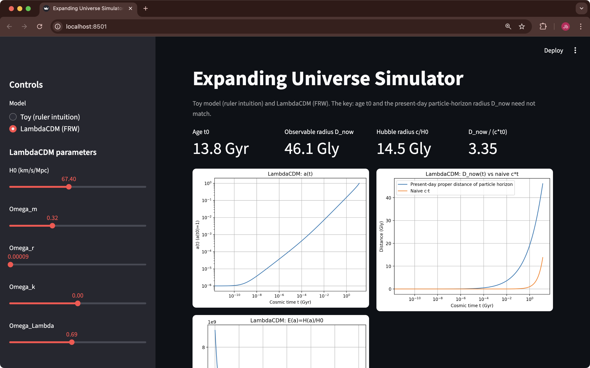

# universe_size_simulator

- JPark, 2026-01-18 (Sun.) with ChatGPT 5.2
- Q. 우주의 나이는 약 138억살인데, 왜 관측가능한 우주의 반지름은 약 460억 광년 인가 ? (2026년 1월 기준)

## 참고

- Hubble's Law : https://en.wikipedia.org/wiki/Hubble%27s_law
- 허블-르메트르 법칙 : https://ko.wikipedia.org/wiki/허블-르메트르_법칙

## Demo pages

## 장난감 우주모형 I

### 설정
지금 설정은 “팽창 우주”를 속도로 직관화한 장난감 모형이고, 여기서 중요한 포인트는:
- 우주의 나이는 그냥 “시작 후 지난 시간”
- (a–b 사이) 크기/거리는 “그 시간 동안 공간이 얼마나 늘었는가”

입니다.

### 가정 정리
- t=0에 A와 B가 거의 붙어 있음(초기 거리 D_0 \approx 0)
- A가 B를 향해 빛을 쏨 (빛은 국소적으로 항상 속력 c)
- 동시에 A–B 사이의 공간 자체가 늘어나서 두 점 사이 거리가 늘어나는 속도(후퇴속도)가 c
- 즉 $\frac{dD}{dt} = c$

### 1초 후 “우주의 나이”
- 시작한 지 1초 지났으니
- 나이 = 1초
- (이건 정의 그 자체라서 논쟁 여지가 없습니다.)

### 1초 후 (A–B 사이) “크기/거리”
- $D(t) = D_0 + ct$
- 따라서 1초 후: $D(1) = D_0 + c \cdot 1$

- 초기 거리를 “매우 작다(≈0)”로 두면:
- 거리 ≈ c·1초 = 1 라이트세컨드(1 광초)
- 수치로는 약 3.0\times 10^8 m (정확히 299,792,458 m)

### 그럼 빛은 1초 뒤에 B에 도착했나?

여기가 이 예시의 핵심이에요.
- 빛은 1초 동안 공간을 가로질러 1 광초만큼 전진
- 그런데 목표점 B도(정확히는 A–B 사이의 공간이) 같은 시간 동안 1 광초만큼 “도망감”

그래서 초기 거리가 거의 0이라면, 1초 뒤에도
- 빛과 B의 거리는 여전히 거의 1광초 수준으로 남고
- 빛은 B에 도착하지 못합니다 (간격을 “못 줄이고” 제자리걸음)

즉 이 설정에서는 “빛의 전진 속도”와 “거리 증가 속도”가 같아서, 빛이 따라잡지 못하는 거죠.

### 정리
- 나이: 1초
- (A–B 사이) 크기/거리: 초기거리 D_0에 1광초가 더해짐
- $D_0 \approx 0$ 이면 ≈ 1광초

## 장난감 우주모형 II

“진짜 FRW 우주를 흉내 내되,
수식 없이 ‘눈금이 늘어나는 자’라는 장난감 모델로
나이와 관측가능 크기를 직접 계산해 보자”라는 접근법으로
나이와 크기를 계산해 보겠습니다.

### 1️⃣ 장난감 우주를 정확히 정의하자

우리는 다음만 가정합니다.

(A) 공간은 1차원 자
- a ——————— b
- a, b = 관측가능 우주의 경계

(B) 시간에 따라 눈금이 늘어남
- 눈금 간격 = a(t)
- 초기: 눈금 매우 촘촘
- 현재: 눈금 듬성

(C) 빛의 규칙 (국소성)
- 빛은 항상 자기 주변 눈금 기준으로 c

즉,

1초에 ‘c만큼의 눈금 길이’를 건너감

### 2️⃣ “관측가능 우주”를 이 자에서 어떻게 정의하나

아주 중요합니다.

관측가능 우주 =
t=0에서 출발한 빛이
t = 현재까지 건너온 ‘눈금 개수’

이걸 $\chi$ 라고 부릅니다.
(공동이동 거리)

### 3️⃣ 이제 정말로 계산해 보자 (수식 최소)

- 1초 동안 빛이 건너는 눈금 수

$ \Delta(\text{눈금 수}) = \frac{c \cdot 1\text{초}}{\text{눈금 간격}} = \frac{c}{a(t)} $

⸻

- 전체 눈금 수 (관측가능 경계)

\chi = \int_0^{T} \frac{c\,dt}{a(t)}

📌 이 적분은 “빛이 총 몇 칸을 건너왔는가”

⸻

### 4️⃣ 이제 ‘완전히 단순한’ a(t)를 하나 고르자

당신의 취지에 맞게 가장 직관적인 선택을 하겠습니다.

선택:

a(t) = k \, t
	•	초기 t \to 0: 눈금 매우 촘촘
	•	시간이 갈수록 선형으로 늘어남

(이건 실제 우주와 다르지만, 직관에는 충분)

### 5️⃣ 관측가능 우주의 “눈금 개수” 계산

$$
\chi = \int_0^{T} \frac{c\,dt}{k t}
= \frac{c}{k} \int_0^{T} \frac{dt}{t}
$$

이 적분은:
$$ 
\chi = \frac{c}{k} \ln T + (\text{상수})
$$

📌 핵심 포인트:
- 초기 구간이 지배적
- 시간이 조금만 지나도 눈금 수가 확 늘어남

⸻

### 6️⃣ 이제 “현재 기준 크기”로 환산

현재 눈금 간격:
$ a(T) = kT $

그래서 현재 기준 거리:
$$
D_{\text{now}} = a(T) \cdot \chi
= (kT) \cdot \frac{c}{k} \ln T
= c T \ln T
$$

⸻

### 7️⃣ 이제 질문에 답할 수 있습니다

✔ 우주의 나이

$\text{나이} = T$

⸻

✔ 관측가능 우주의 크기

$D_{\text{now}} = c T \ln T$

👉 명백히 cT보다 큽니다.

이게 바로:

“나이는 T인데, 크기는 cT보다 큰 이유”

입니다.

⸻

### 8️⃣ 이 장난감 모델에서 직관 정리
- 빛은 항상 c
- 하지만:
- 초기에 눈금이 촘촘해서
- 많은 칸을 벌어놓음
- 나중에:
- 눈금이 늘어나서
- 그 칸 하나하나가 길어짐

👉 그래서:

- 빛이 이동한 시간보다
- 현재 거리로 환산하면 더 멀어짐

### 9️⃣ 이제 당신의 마지막 질문에 정확히 답

= “a–b 공간이 늘어나서 빛이 더 오래 걸리는 거 아닌가요?”

👉 아닙니다.
- 빛이 “더 오래 걸린 게 아니라”,
- 같은 시간 동안 이동한 ‘눈금 개수’가 나중에 더 길어졌을 뿐입니다.

⸻

### 🔚 최종 한 문장 요약

- 관측가능 우주의 크기는 빛이 이동한 시간의 문제가 아니라, 빛이 ‘언제’ 이동했는가의 문제다.

## 우리 우주모형 

